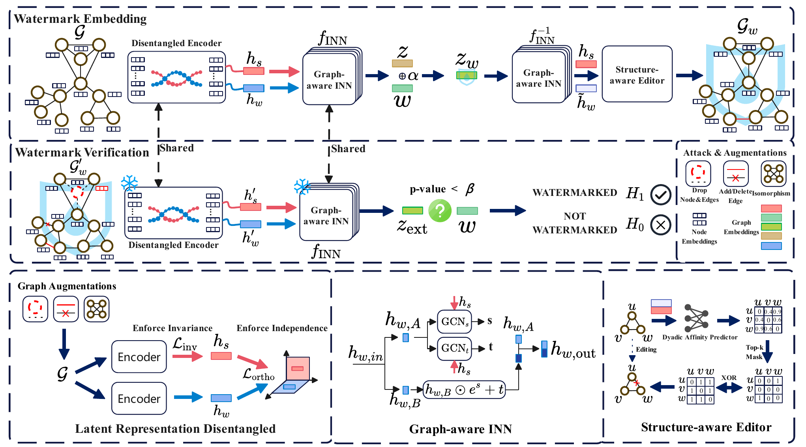

# DRGW

Code for **[DRGW: Learning Disentangled Representations for Robust Graph
Watermarking](https://doi.org/10.1145/3774904.3792543)** (WWW 2026).

Jiasen Li, Yanwei Liu, Zhuoyi Shang, Xiaoyan Gu, Weiping Wang

[Paper](https://doi.org/10.1145/3774904.3792543) | [PDF](https://arxiv.org/pdf/2601.13569) | [arXiv](https://arxiv.org/abs/2601.13569) | [BibTeX](#citation)

DRGW combines a disentangled GIN encoder, a graph-aware invertible network,
and a structure-aware edge editor. A Gaussian watermark is injected into the
carrier representation and translated into budgeted edge edits. Verification
uses the candidate graph and the owner's watermark, without the original graph.

<p align="center">
  
</p>

*Watermark embedding and verification in DRGW (Figure 2 in the paper).*

## Installation

Use Python 3.12 with a compatible [PyTorch build](https://pytorch.org/get-started/previous-versions/).

```bash
git clone https://github.com/Tthvic/DRGW.git
cd DRGW
conda create -n drgw python=3.12 -y
conda activate drgw
python -m pip install torch==2.13.0 --index-url https://download.pytorch.org/whl/cu130
python -m pip install -e .
```

## Quick Start

Prepare the datasets, train the model, and evaluate its checkpoint:

```bash
python -m drgw prepare --config configs/main.yaml
python -m drgw train --config configs/main.yaml --seed 0 --device cuda:0
python -m drgw evaluate --config configs/main.yaml \
  --checkpoint results/main/drgw/seed-0/checkpoint.pt --device cuda:0
```

The default configuration is in [`configs/main.yaml`](configs/main.yaml).
Use `--resume` to continue training, or `configs/smoke.yaml` for a small workflow
check. Data, checkpoints and generated outputs are saved under `data/` and
`results/`.

## Embed and Verify

Create an owner key, embed it into a graph, and verify the resulting graph:

```bash
python -m drgw keygen --output results/owner-key.npy
python -m drgw embed \
  --checkpoint results/main/drgw/seed-0/checkpoint.pt \
  --graph graph.npz --key results/owner-key.npy \
  --output results/watermarked.npz --budget-ratio 0.001 --device cuda:0
python -m drgw verify \
  --checkpoint results/main/drgw/seed-0/checkpoint.pt \
  --graph results/watermarked.npz --key results/owner-key.npy --device cuda:0
```

Here `graph.npz` contains an adjacency array named `adj`. Add `--sparse` for
graphs stored as SciPy CSR files. See the [usage guide](docs/usage.md) for input
examples and verification-score calibration.

## Documentation

| Topic | Guide |
| --- | --- |
| Encoder, invertible network and edge editor | [Method](docs/method.md) |
| Data sampling, training, attacks and metrics | [Experiment protocol](docs/protocol.md) |
| Input formats, verification and sparse inference | [Usage](docs/usage.md) |
| Multiple seeds, baseline and utility evaluation | [Experiment commands](docs/usage.md#experiment-commands) |

## Citation

If you use this work, please cite:

```bibtex
@inproceedings{li2026drgw,
  title     = {DRGW: Learning Disentangled Representations for Robust Graph Watermarking},
  author    = {Jiasen Li and Yanwei Liu and Zhuoyi Shang and Xiaoyan Gu and Weiping Wang},
  booktitle = {Proceedings of the ACM Web Conference 2026},
  pages     = {3263--3274},
  year      = {2026},
  doi       = {10.1145/3774904.3792543}
}
```

Code is released under the [MIT license](LICENSE).
